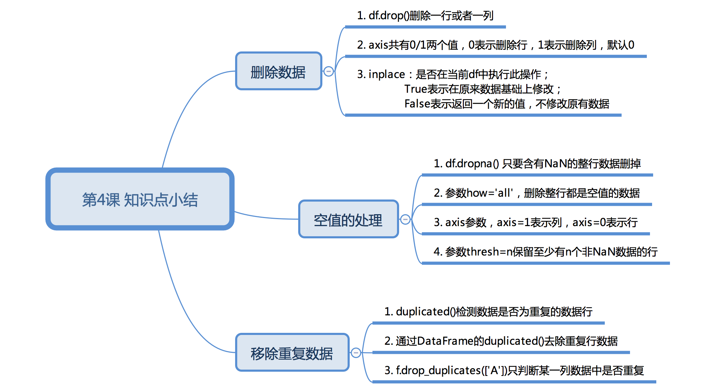
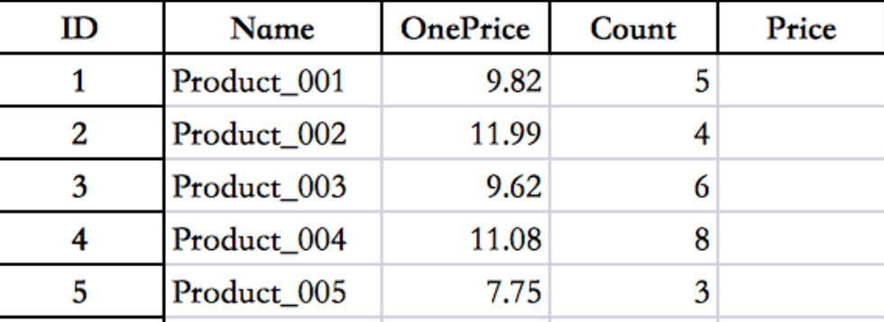

## 数据七十二变

### 课程介绍

Hello, 我是小K，很高兴又和大家见面了，我们一起继续学习Python数据分析。

为了让你能不受干扰的在学习数据分析路上饱览胜景，请将屏幕调整成全屏，Windows系统：请按**F11**（或**Fn+F11**)；苹果系统：请同时按**control+command+F**。 

在上一节我们解锁了Pandas对数据的永久性保存以及对本地数据的读取。

我们分析的数据来源有很多种，例如：爬取、公司数据库、数据公司等。但是这些数据中有些数据项是我们不需要的，甚至可能会存在重复数据和空值的情况。

所以，本节我们将继续解锁数据七十二变，看一下数据是如何删除多余的数据和重复数据以及空值的处理。

**本节知识点图**


本节课我们将以（1990年到2015年多个国家的年龄抚养比率）数据为课程实验数据。为了满足你们的好奇心，先跟大家科普一下何为年龄抚养比率？

年龄抚养比是非劳动年龄人口（18岁以下至65岁及以上）与劳动年龄人口（18至64岁之间）的“比率”（百分比）。

### 删除数据

数据的路径为`./data/rate.xlsx`，现在我们读取文件，了解一下数据的基本情况，运行下方代码查看结果：

**此处是代码**                —————————————    ——————————— **终端**

```python
import pandas as pd
df = pd.read_excel('./data/rate.xlsx')
print(df.shape)
print(df.head())
```


在结果中我们发现有多个NaN，那NaN表示的是什么数据呢？

如果文件的单元格中没有值时，在使用pandas读取后就会用NaN表示，也就是我们常说的空值。

在NumPy模块中提供了nan的值，如果你想要创建一个空值，可以使用下方代码：

```python
from numpy import nan as NaN
```

而且需要注意的是，NaN比较特殊点就是其本身是一种float类型数据。

```python
print(type(NaN))
```

但是，当NaN可以参与到数据计算中，最终的结果却永远都是NaN。

```python
print(NaN+1)
```

所以，当我们不知道的情况下会影响我们的计算结果。

请抄写代码到下面的代码框运行：

**此处是代码**                —————————————    ——————————— **终端**

```python

```

对于大批量的Series数据，使用肉眼很难判断空值的存在，这时我们可以先对空值进行过滤。

请运行下方代码，查看过滤的方法：

```python
from numpy import nan as NaN
se=pd.Series([4,NaN,8,NaN,5])
print(se.notnull())
print(se[se.notnull()])
```

从结果中可以看出，我们成功的去除了数据中的空值，并且保留了非空的数据。

`se.notnull()`方法可以对每一个数据进行空值判断，最后返回一个bool类型数据，空值用False替代，同理非空用True值替代。

然后使用`se[se.notnull()]`取值方式，就会过滤掉空值，保留非空值。

但是在DataFrame类型数据中，我们只能`notnull()`方法判断是否有空值存在，确不能使用`se[se.notnull()]`取值方式过滤空值。

运行下方代码，查看空值数据是否被过滤：

```python
import pandas as pd
df = pd.read_excel('./rate.xlsx')
print(df.notnull())
print(df[df.notnull()])
```

通过结果我们发现，结果中依然存在空值，并没有过滤掉空值。

所以在DataFrame类型数据中，一般我们会将存在NaN的数据使用`dropna()`方法全部删掉：

```python
df1 = df.dropna()
```

`dropna()`是删除空值数据的方法，默认将只要含有NaN的整行数据删掉，如果想要删除整行都是空值的数据需要添加`how='all'`参数。

如果想要对列做删除操作，需要添加axis参数，axis=1表示列，axis=0表示行。

我们也可以是用thresh参数筛选想要删除的数据，thresh=n保留至少有n个非NaN数据的行。

接下来抄写代码到下面的代码框运行，测试两个参数：

**此处是代码**                —————————————    ——————————— **终端**

```python

```

到这里有同学会问，如果我只是单纯的想删除两行数据该怎么做呢？

如果只是单纯的想删除数据，我们可以使用`df.drop()`方法，一起来了解一下该函数。

```python
DataFrame.drop(labels=None,axis=0, index=None, columns=None, inplace=False)
```

`labels` ：就是要删除的行列的名字，用列表给定；

`axis `：默认为0，指删除行，因此删除columns时要指定axis=1；

`index`： 直接指定要删除的行；

`columns`： 直接指定要删除的列；

`inplace=False`：默认该删除操作不改变原数据，而是返回一个执行删除操作后的新dataframe；

`inplace=True`：则会直接在原数据上进行删除操作，删除后无法返回；

所以，根据参数我们可以总结出，删除行列有两种方式：

1. labels=None,axis=0 的组合
2. index或columns直接指定要删除的行或列

请在下面代码框中，尝试删除一行数据和一列数据：

```python

```

看一下，小K的代码：

```python
import pandas as pd
df = pd.read_excel('./rate.xlsx')
# 删除第0行和第1行
# df.drop(labels=[0,1],axis=0)

# 删除列名为1990的列
df.drop(axis=1,columns=1990)
```

### 空值的处理

对于空值我们可以将整条数据删除，也可以使用`fillna()`方法对空值进行填充。

```python
df.fillna(value=None, method=None, axis=None, inplace=False, limit=None, downcast=None, **kwargs)
```

>value：需要用什么值去填充缺失值
>
>axis：确定填充维度，从行开始或是从列开始
>
>method：
>
>​	ffill：用缺失值前面的一个值代替缺失值，如果axis =1，那么就是横向的前面的值替换后面的缺失值，如	         果axis=0，那么则是上面的值替换下面的缺失值。
>
>​	bfill：缺失值后面的一个值代替前面的缺失值。
>
>limit：确定填充的个数，如果limit=2，则只填充两个缺失值。
>
>**注意：method参数不能与value参数同时出现。**

下面,请分别打开左边代码框中的代码注释, 然后运行观察结果：

**此处是代码**                —————————————    ——————————— **终端**

```python
import pandas as pd
df = pd.read_excel('./data/rate.xlsx')
# 用常数填充fillna
# print(df.fillna(0))

# 用一列的平均值填充
# print(df.fillna(df.mean())

# 用前面的值来填充ffill   
# print(df.fillna(method='ffill',axis=0))
```

### 重复数据的处理

重复数据的存在有时不仅会降低分析的准确度，也会降低分析的效率。所以我们在整理数据的时候应该将重复的数据删除掉。

利用`duplicated()`函数可以返回每一行判断是否重复的结果（重复则为True)。

运行下面的代码，观察结果是否有重复数据：

**此处是代码**                —————————————    ——————————— **终端**

```python
import pandas as pd
df = pd.read_excel('./data/rate.xlsx')
# 返回重复的结果
print(df.duplicated())
```

通过结果我们发现，返回的是一个值为Bool类型的Series，如果当前行所有列的数据与前面的数据是重复的就返回True；反之，则返回False。

可以使用`drop_duplicates()`将重复的数据行进行删除。

```python
df.drop_duplicates()
```

我们也可以只可以通过判断某一列的重复数据，然后进行删除

```python
df.drop_duplicates(['CountryName'],inplace=False)
```

其中`['CountryName']`表示对比CountryName例数据是否有重复，`inplace`用来控制是否直接对原始数据进行修改。

现在是否已经理解如何处理重复值了呢？可以将上面的代码复制过来，验证你的想法：

**此处是代码**                —————————————    ——————————— **终端**

```python

```


### 本节总结

到此，我们就将年龄抚养比率数据的空值、重复数据已经处理完毕。遇到不同的数据时，我们应该灵活应对，万变不离其宗，本质都是一样的，所以大家要勤加练习。



### 下节预告


### 练习1

题目：如果你不需要，就让它消失！

题目要求：

从自2009-2010赛季以来的英格兰当地足球比赛结果数据中，删除2009/2010赛季的所有数据以及county列。

文件路径为：`./data/sccore_game.xlsx`

> game_date-比赛时间
> country-国家
> tournament-锦标赛
> season-赛季
> home_field-主场场地
> home_team-主场球队
> away_team-客场球队
> home_team_score-主场球队得分
> away_team_score-客场球队得分
> home_team_score_extra_time-主持球队加时赛
> away_team_score_extra_time-客场球队加时赛

参考答案：

```python
import pandas as pd
df = pd.read_excel('./data/sccore_game.xlsx')
print(df.shape)

# 通过遍历获取2009/2010赛季的数据索引（下节课我们将学习其他获取方式）
index_list = []
for index,row_data in df.iterrows():
    if row_data['season']=='2009/2010':
        index_list.append(index)

# 删除2009/2010赛季的数据
df1 = df.drop(index_list,axis=0)
# print(df1)

# 删除country列
df2 = df1.drop('country',axis=1)
print(df2)
```


### 练习2

题目：算你狠

题目要求：



根据文件（./data/04Books.xlsx.）中的商品的单价（OnePrice）和购买数量（Count）计算出对应的总价（Price）。

参考答案：

```python
import pandas as pd
books = pd.read_excel('./data/04Books.xlsx',index_col = 'ID')
print(books)

# 计算Price的值(这种方法是列与列之间对齐后进行计算)
# books["Price"] = books['OnePrice'] * books['Count']
# print(books)

# 如果只想算某一段就可以，使用循环迭代（是单元格与单元格之间的操作）
# for i in range(5,16):
#     books["Price"].iloc[i] = books["OnePrice"].iloc[i] * books["Count"].iloc[i]
# print(books)
```


